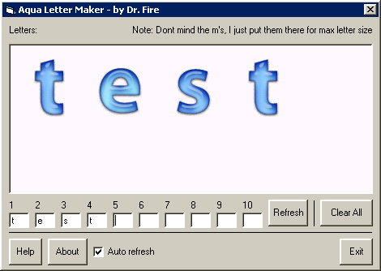



## Aqua Text Creator v1\.0

### Description

With this program, you can create aqua text. I made all the aqua letters from scratch with Photoshop. I spent 50 minutes just making them. Spent an hour on making the program itself. Believe me when I say I put plenty of work into this. I made this because I hate doing all these steps in photoshop just to make some simple aqua text. So I made all the letters and put them in this so you can create the text in seconds. Unfortunetly, I cant find a way to save it, so youll have to go threw the help steps to save it. As this is version 1.0, the next version will have every character on the keyboard for you to use, several text styles, background color changing, and more room for more letters. There isnt any super hard coding going on here, but it was hard to make because of the graphics. Please enjoy! Please leave plenty of feedback, I could use some motivation for v2.0, because adding all that stuff is going to take some time, and id rather not do it. Thanks.
 
### More Info
 

             |
---                |---
**Submitted On**   |2003-12-21 01:03:06
**By**             |[Jesse Seidel \(Dr\. Fire\)](https://github.com/Planet-Source-Code/PSCIndex/blob/master/ByAuthor/jesse-seidel-dr-fire.md)
**Level**          |Beginner
**User Rating**    |4.0 (28 globes from 7 users)
**Compatibility**  |VB 6\.0
**Category**       |[Graphics](https://github.com/Planet-Source-Code/PSCIndex/blob/master/ByCategory/graphics__1-46.md)
**World**          |[Visual Basic](https://github.com/Planet-Source-Code/PSCIndex/blob/master/ByWorld/visual-basic.md)
**Archive File**   |[Aqua\_Text\_16856712212003\.zip](https://github.com/Planet-Source-Code/jesse-seidel-dr-fire-aqua-text-creator-v1-0__1-50547/archive/master.zip)

